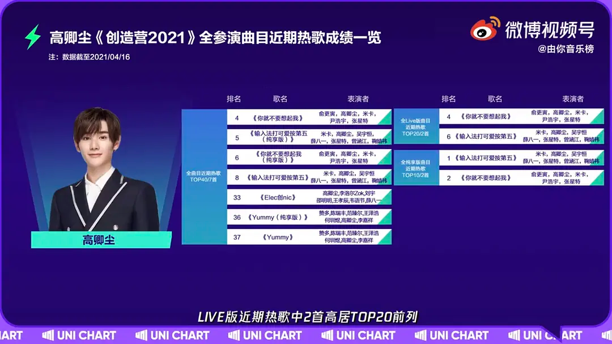
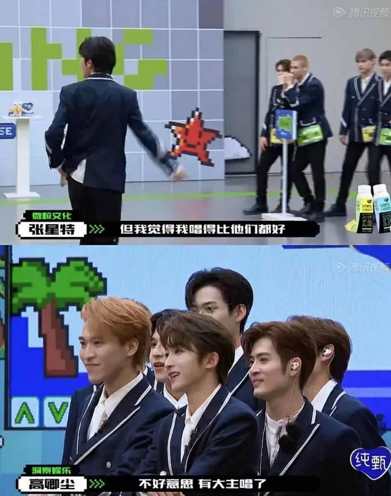
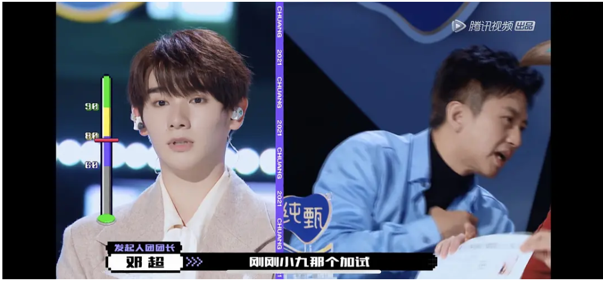
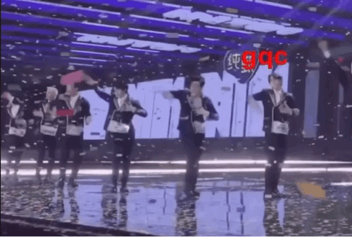
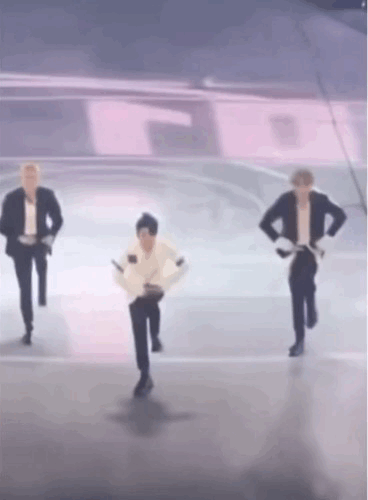

高卿尘粉丝一直标榜高卿尘是创造营的音源王，并屡次以热歌图来显示唱歌实力，此头衔更在决赛三公选歌时，高卿尘本人的一句“sorry, 已经有大vocal“了被粉丝认为做实。先不论所谓的热歌里，均有像俞更寅，张星特等国内实力唱将，也有像米卡这样的国外唱将，而且本身的歌曲选择传唱度就很好，所以歌曲热度高，只能说明高卿尘他会选择歌，以及团队成员好，和他本人可以说是毫无关系。

  

    
    

      
赛时音源排名

    

  

  

    
    

      
sorry, 我们有大vocal了

    

  

那高卿尘唱歌实力到底如何，我们来看他创造营期间舞台所有表现。

以下内容皆为网络公开内容，🔗链接都会在footnote给出。
{:.info}

# vocal实力
高卿尘的唱歌实力从初舞台开始就不是很亮眼，然而靠着剪辑和人设被活生生塑造成了营里的大vocal.
## 初舞台不加分
初舞台加试唱歌不仅没有加分，更是成为了减分项。在座的评委基本观点一致。

  

    
  

  

    
  

  

    
  

## 一公舞台无亮点



## 二公靠队友垫音

二公得到了撑腰王，是否真实我们无从验证。
但是被观众认可的高音部分，确是靠俞更寅全程垫音。而俞更寅则是营内人公认的大vocal。



## doki见面会靠队友和声

全开麦唱歌走调， 咬字不清，基本靠队友和声。



## 决赛破音

决赛舞台破音，台下的观众反应如下

  

    
  



# 舞蹈划水

## 创造营训练室偷懒

## 成团舞跳错三次（截止2021年6月

### 成团夜跳错

  

    
    

      
成团夜忘记动作，手足无措

    

  

### 首秀舞台跳错

  

    
    

      
成团后第一次舞台，忘记腿部动作

    

  

### 快手真心夜两首均跳错

into1从成团夜开始，总共加起来就三个舞台，除了惊奇夜之外，每个舞台都做错。彩排的时候胳膊懒得动，甚至连腿都不伸。和左右两边的米卡和尹浩宇形成鲜明对比

（可能有人说墨墨在彩排时也没有大力跳，但他在正式舞台上可是熟练得很。）



接下来是正式的舞台，总共两首个，一首在舞台上就跳过至少3次的成团曲再次挑错。一首新歌，除了高卿尘其他人均完成度很高。

成团舞第三次忘记动作（视频5:20），而粉丝以耳返漏电为藉口为其推脱。耳返出现问题实是在视频5:49左右。

  

    
    

      
成团舞忘记动作

    

  

以下是全队舞蹈正面俯拍，高卿尘舞蹈动作错的非常明显，且**长达10秒**。



快手真心夜的第二首歌曲，是into1的新歌，可以理解新歌不熟悉。但是同时作为缺席训练的林墨，缺没有出现同样的失误。

  

    
    

      
新歌曲再次忘记动作

    

  

# 总结

综上，高卿尘作为创造营2021第五名出道的选手，不仅唱歌实力存疑，舞蹈能力不行，个人的态度问题更是值得商榷。但是每次舞台，缺总是奇迹般隐身。

糊是最好的保护色
{:.error}