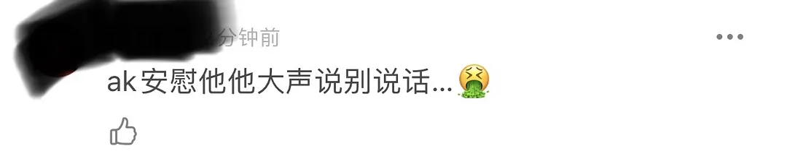
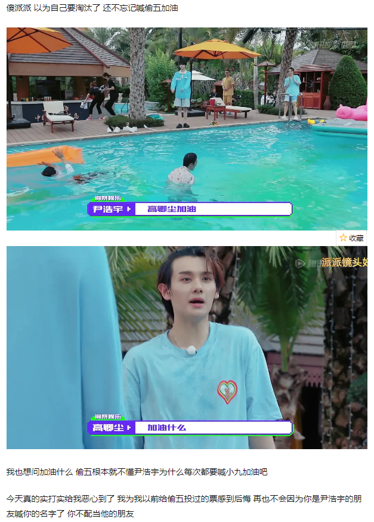

本站所有内容都会**不断更新和校正**，保证资料的真实和准确，所有内容都以发布在网站的内容为准，若读者看到关于本网站的截图与网站内容有出入的，视为截图无效。欢迎各位读者投稿和校正。
{:.warning}

**写在前面**：

> 不管是明星还是秀人，作为粉丝或者路人没有近距离的了解过，是无法知道真正了解本人的。此贴的目的，并不在于对于高卿尘本人的过分解读，而是通过收集他镜头前的一系列行为和表现，来尽量的拼凑一些他性格和人品的边角。在镜头前，一般人都是会尽量的去展示自己好的一面。
> 然而我们通过搜集他从在创造营内，创造营外，成团后一系列的表现，可以清楚的了解到，他过度营销`甜心`{:.error} 或者`happiness`{:.error}的人设，但自身表现出来的反而是一个对朋友不尊重，对队友没礼貌，非常没有分寸感的人。

# 自我标榜大vocal 

在决赛张星特选曲的时候，主动对着张星特喊， 这里有大vocal咯。

<video controls width="100%" height="auto">
    <source src="../assets/images/nine/facial-expression/vocal.mp4">
    Sorry, your browser doesn't support embedded videos.
</video>

在高卿尘说完这句话的时候洞察娱乐买了大量营销号`炒作高卿尘综艺感满分`{:.error}

  

    
    
  

此营销并没有获得期待的效果，反而让大家对高卿尘本人的言论反感。高卿尘粉丝对此此事赶紧写稿洗白，然而在豆瓣已经评论全面翻车。

  

    
    
  

# 成团分宿舍vlog

## 暗婊队友不是正常人

在INTO1第一期分宿舍团综时，团员在讨论担当，有保洁担当，干饭担当，当问到高卿尘的时候，高卿尘说，**我不用，是正常人**。ak插了一句，不，你不是。周柯宇补了一句你是噪音担当，ak立马帮圆场说那不是我吗。

  

    
    
  

## 分房间心机

—开始说只有一个双人间，其他都是单人间，问成员有谁想住双人间的。张嘉元说想住12人间，(玩梗，也说明不排斥和别人一起住)，而林墨直接说了想和AK住，并不是没人想住双人间的情况，高卿尘说，如果你们不想和别人一起住，我和刘宇可以**牺牲**我们自己(住双人间)。伯远接了一句你中文有点太好了现在。

  

    
  

## 泰国“励志偶像”嫌弃中国别墅

当高卿尘看到自己的宿舍以后就开始臭脸，张嘉元AK伯远接连安慰他，说整个一层都是你的，你还有花园，高卿尘依旧臭着脸大喊这个房子太土了！据悉INTO1宿舍坐落于北京明星云集的别墅区，要知道，世界上还有很多贫穷国家的孩子还吃不上饭穿不起衣服，一直给自己塑造**妈妈需要存钱买来中国机票**贫苦泰国人民人设在节目里**镜头前**嫌弃别墅太土来不喜欢。不仅仅打脸人设，更是证明了其富二代的家世。
泰国的富二代在节目里公然在嫌弃别墅太土了不喜欢。<a class="button button--error button--rounded button--md" href="#">点击查看高卿尘真实家世</a>

  

    
  

## 对“想要一起成团”的米卡：ewww

米卡看高卿尘一直抱怨，应该是先想着他会换房间到b栋和自己一起，于是想让高卿尘开心，让他想象如果和自己住一起的话，能他一起学中文，而且还主动抱他让他cheer up。但是高卿尘却比了一个zero零（意思是和你一起学不到中文，此梗在创造营的时候高卿尘也提及过一次，暗指外国人米卡没有好好学习中文。）米卡抱他的时候也没有回抱。

  

    
  

后来米卡直接提议如果高卿尘和林墨换房间，这样就可以和米卡，尹浩宇，伯远住b栋。高卿尘的下意识反应eww…，当事人一脸震惊。尹浩宇出来打圆场说先去b栋看一下吧。（当时还在a栋没看过b栋房间）

  

    
    
  

eww在此团综播出后引起粉丝热议，高卿尘粉丝解释说高卿尘用eww是因为英文不好。
然而高卿尘就读于泰国易三仓学院，此学院为泰国全英文授课的贵族学校（关于他就读学校以及身世的细节，请[看此文章]("/nine/nine-finance"）)。在官方资料中，高卿尘是能够流利说英文和泰文的，且粉丝一直以是`掌握多国语言，万内真正走向international的人`{:.error}自居。[^1]此解释不仅不成立，更是否认高卿尘本人的能力。

[^1]: [豆瓣原帖](https://www.douban.com/group/topic/226159776/)

  

    
  

另外还有粉丝洗白说eww可以用于朋友之间开玩笑。没错，`fxxk you, bitch` 等所有的脏话都可以用来开玩笑，但是前提是1. 说话的语境可以让你开玩笑; 2. 说话的双方认可开玩笑。此期团综里，米卡听到ewww之后明显一愣，尴尬的问他what？然后迅速黯然走开。开播后，观众反应不适更一步说明了语境不适合。所以只能说明是高卿尘粉丝强行洗白。

  

    
    
  

## 甜心”也会故意刁难？🙀

张嘉元选到了目前为止最大的有独卫的单人间，应该是所有房间里最好的一间。高卿尘马上说我可以跟你换吗，张嘉元摇头后高卿尘就又变了脸。

  

    
       
  

米卡看到自己的老旧的房间及配置以后也有些崩溃，一直在喊what what what。林墨不知为何也不太喜欢自己的房间，问米卡要不要换房间，米卡因为林墨那间要和别人共用卫生间，还是选择了自己那间可以独立使用卫生间的房间，虽不太满意但还是接受了自己的房间。

  

    
  

此时的高卿尘还赖在地上觉得自己的房间不好，AK和伯远在安慰劝导他。

  

    
  

众人逛完b栋回到a栋客厅的时候，AK又叫了他一声，高卿尘大声回答道：别说话。

  

    
    
  

看见高卿尘依旧臭脸，林墨出于好心问了第一遍，你想和我换吗，高卿尘没有理会。直到节目组问有没有人想换房间，高卿尘举了手，林墨又问了第二遍，他说**no**。

  

    
      

        
第一遍林墨主动问的时候高卿尘没理

    

  

  

    
    

        
第二遍节目组问，高自己举手。林墨又主动问第二遍，高卿尘说了no。

    

  

一番周折之后，所有人对自己房间的态度都已经很明确，大家几乎都已接受了事实。林墨两次主动询问是否要交换房间都没有得到高卿尘的肯定回应，节目组出面之后高又当面拒绝。
最后周柯宇来帮忙打圆场，但高卿尘依旧没有好脸色还戴上了墨镜。明明中文水平很好的他，却说自己听不懂。

  

    
  

最后没人安慰他了大家都回去睡觉，高卿尘在客厅拿枕头撒气表示要在客厅睡，只有林墨还在问他要不要换房间

  

    
  

总结：

这宿舍确实不尽人意，粉丝们全在吐槽连酒店不如50一晚的旅馆。除了个别房间，大多数人其实都不满意自己的房间。力丸小声的说房间有点小，尹浩宇走之前说自己的房间不是那么好看，想拿走一个花瓶当装饰，米卡吐槽电视机占了半个房间，但还是为了独卫接受了（因为只有林墨想换房间但林墨不是独卫）。大家就算抱怨最后也不得不接受，房间也是抽签决定的。高卿尘的反应不仅不符合他塑造的人设，对刚成团的各位队友的态度也是非常没有分寸。

豆瓣上看过视频的网友反应也很强烈。

  

    
  

# 对曾涵江秒变脸

  

    
  

曾涵江粉丝把上面的视频上传后，遭到了高卿尘粉丝的辱骂。

  

    
  

# 肆意嘲讽队友张嘉元

采访的时候张嘉元清唱了《我走后的夜与昼》，是当初银河系和邓紫棋合作的那首歌，他唱歌时高卿尘的表情也很一言难尽甚至还笑出声了，可谓是爱豆表情管理崩坏的典型。张嘉元本来很自信的在唱，搞得场面一度有些尴尬。张嘉元的唱功此处不作讨论，当时他唱歌的状态还是很投入的。高卿尘的反应连最起码的尊重人都没做到，一个有素质体面的成年人是不会做出当面嘲笑的行为吧。

<video controls width="100%" height="auto">
    <source src="../assets/images/nine/facial-expression/嘲笑张嘉元唱歌.mp4">
    Sorry, your browser doesn't support embedded videos.
</video>

网友对此也不满。

  

    
    
  

# 尹浩宇真心喂了狗

高卿尘和尹浩宇作为同一家公司出来的训练生，按理说感情应该很深，在初舞台的时候尹浩宇表示对高卿尘的感情很深。但在整个创造营里，尹浩宇多次cue高卿尘是最好的朋友，而高卿尘反而多次在镜头前翻白眼。如果不喜欢，在私下做什么粉丝或者路人都管不着，但是在镜头前多次这样的举动，是否合适？

## 大岛日记里翻白眼

此视频来源于微博网友上传资料，[点击查看原帖](https://m.weibo.cn/status/4620812134647113?sourceType=weixin&from=10B6295010&wm=9006_2001&featurecode=newtitle)

<video controls width="100%" height="auto">
    <source src="../assets/images/nine/facial-expression/hyh-diary.mp4">
    Sorry, your browser doesn't support embedded videos.
</video>

在此视频中，当尹浩宇说高卿尘是他的哥哥的时候，高卿尘明显的翻了一个大大的白眼。
高卿尘在尹浩宇的大岛日记里公然表示，在泰国的时候不喜欢他的外形，甚至用上hate这样的词。豆瓣也有网友表示，这样的语气用在自己朋友身上，十分不合适。

  

    
  

## 从不回应友情

尹浩宇在发布排名感言的时候说高卿尘是他的everything，转头高卿尘就对刘宇说。

  

    
  

后台采访高卿尘，问他有没有什么相对尹浩宇说的，高卿尘直接说没有，而尹浩宇则表示非常开心可以和高卿尘一个舞台。

  

    
      
  

## 双人直播露馅

尹浩宇和高卿尘给泰国粉丝直播，在直播间里唱歌。尹浩宇唱歌的时候，高卿尘在旁边挤眉弄眼，很不礼貌。然而高卿尘唱歌的时候，尹浩宇在一旁认真听而且在高卿尘破音（高本人承认）后还鼓励“唱的很好”。这就是高卿尘对好朋友的态度吗？

<video controls width="100%" height="auto">
    <source src="../assets/images/nine/facial-expression/yhy-14.mp4">
    Sorry, your browser doesn't support embedded videos.
</video>

[视频出处](https://video.h5.weibo.cn/1034:4628463274098695/4628464756589041)

## 异次元两面派

高卿尘在最后一次异次元的活动中，对尹浩宇的态度实在不像是好朋友的态度。

  

    
    

        
尹浩宇在节目中像高卿尘求救，高听到后翻白眼

    

    
  

然后为了在游戏中挑拨吴宇恒和尹浩宇的关系。虽然异次元游戏需要成员结盟，但是没有队友会在背后说别人可怕。

  

    
  

豆瓣网友看节目后，对高卿尘在节目中的表示不适。

  

    
    
    
    
  

在游戏的后面环节里，尹浩宇失败后还不忘给高卿尘加油，高卿尘的反应再次大跌眼镜。

  

    
  

# 对未出道选手大肆炫耀

在成团夜的之后，吴宇恒后台录制了[vlog](https://weibo.com/tv/show/1034:4643673837862983?from=old_pc_videoshow)，在视频中高卿尘本人对着摄像头说 “我是into1的小九高卿尘 第五名 谢谢“。 对于刚没有成团的吴宇恒来说，这样对着他说，不仅不礼貌，而且丝毫不考虑吴宇恒的感受。

  

    
    
  

豆瓣网友发截图后，从每个帖子评论的点赞数量来说，足以看出众网友对高卿尘种种的表现观感真的非常差，口碑再次翻车。

# 对粉丝完全不搭理

高卿尘在和队友看完演唱会后被粉丝认出，迅速离场并全程黑脸不理粉丝热情的打招呼，和旁边的赞多行程鲜明的对比。视频转载于微博，[点击查看原帖](https://weibo.com/tv/show/1034:4632524106956824?from=old_pc_videoshow)

<video controls width="100%" height="auto">
    <source src="../assets/images/nine/facial-expression/long-face-01.mp4">
    Sorry, your browser doesn't support embedded videos.
</video>

部分网友评论

  

    
      
      
  

最后的评论关于一共选曲的视频，指的是[对曾涵江变脸](#zhj)

# 总结

高卿尘初舞台就给自己卖了可爱担当的人设。然而可爱就是他嘲笑队友，给队友翻白眼，对待他人无礼貌的通行证吗？

  

    
  

身为一个公众人物，不仅没有做到正向引导，更是通过自身的人设洗脑粉丝可以不尊重他人。
{:.error}