本站所有内容都会**不断更新和校正**，保证资料的真实和准确，所有内容都以发布在网站的内容为准，若读者看到关于本网站的截图与网站内容有出入的，视为截图无效。欢迎各位读者投稿和校正。
{:.warning}

泰国艺人在本国风生水起，收入不错，却在中国节目中流泪卖惨，利用社会公众的同情，此先路是否可开？希望外国艺人莫要欺负中国粉丝傻钱多，秀芬还是要注重秀人的舞台实力，令选秀节目回归其本真，拒绝利用公众同情刻意卖惨获利的艺人。

# 卖惨时间线

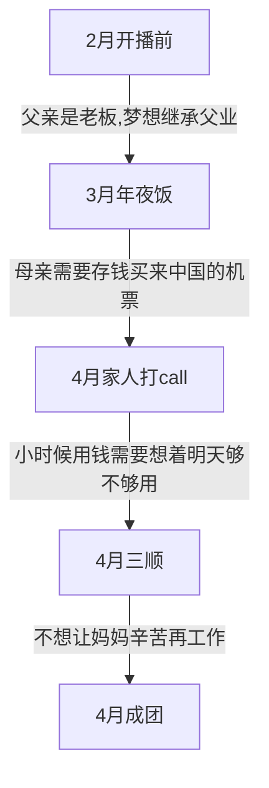

# 创造营开播前

首先，来看一下创造营开播时，高卿尘粉丝对于他本人的科普，[豆瓣原帖](https://www.douban.com/group/topic/212756522/)

  

    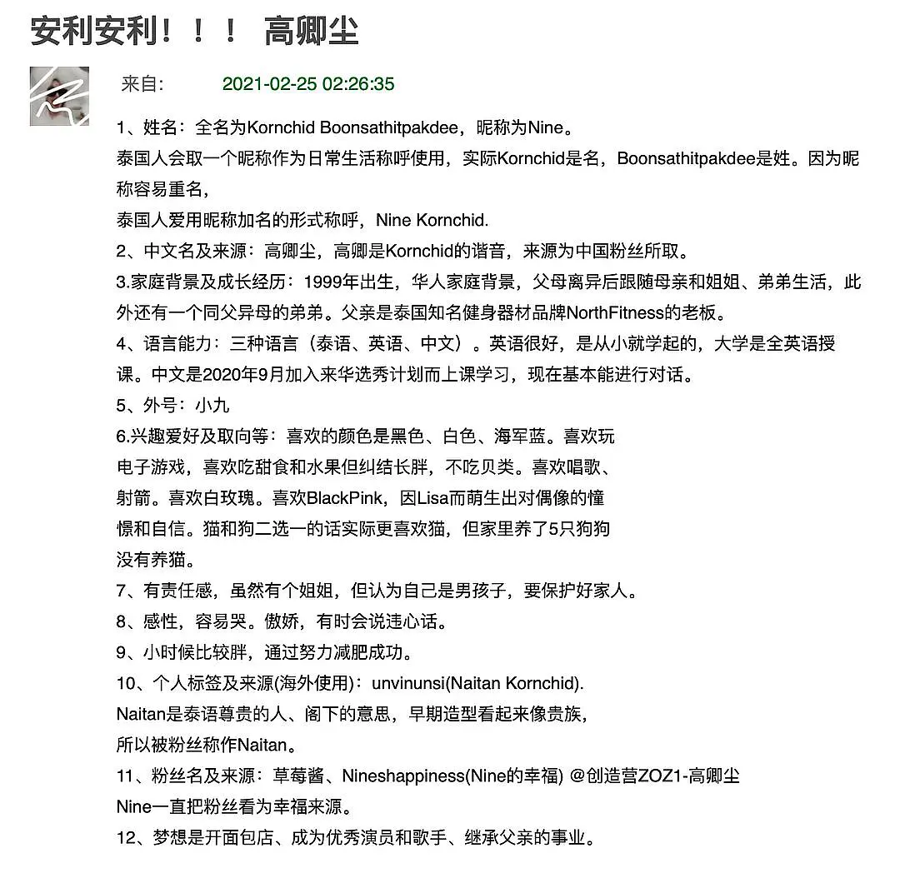
    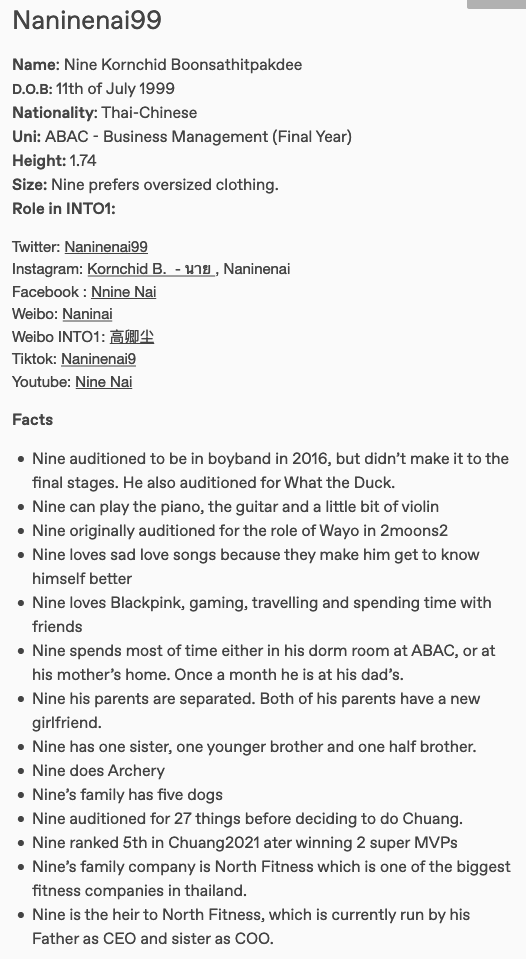
    

    
上图是豆瓣安利，国外粉丝的资料也证实了资料

  

  

几个重点： 
1. 父母离异后跟随母亲和姐姐、弟弟生活 
2. 父亲是泰国知名健身器材品牌NorthFitness老板
3. 大学是全英文授课的私立学校，易三仓大学 
4. 梦想是成为优秀演员和歌手，继承父亲的事业
 
可以说，整个安利的口吻是将高卿尘包装成一个家境不错的泰国选手。

# 在创期间营销贫苦人设

真情实感追过《创造营2021》的人应该都知道“高卿尘家境贫困，家里人需要存钱买来中国的飞机票”这件事，毕竟不止节目中高卿尘多次强调，决赛前家人的应援VCR也有提及，这件事更是在3月20日上过高位rs：在创造营期间，高卿尘与妈妈通话，高卿尘妈妈声称要存钱买来中国的机票，上演了一场悲惨人生奋斗记。看得让人潸然泪下，感动不已，让多少人产生怜爱之情，让路人和多pick时的秀粉连连为他撑腰打钱。

## 卖惨视频合集

<video controls width="100%" height="auto">
    <source src="../assets/images/nine/nine-family/video-cut.mp4">
    Sorry, your browser doesn't support embedded videos.
</video>

## 贫苦人设营销

在节目播出期间，舆论关键词为 **“底层人民”，“泰国穷人”，“母亲欠债”，“父亲瘫痪”，“继父离世”,“存钱买机票”** 营造惨，贫苦氛围的词。

### 微博高位热搜

  

    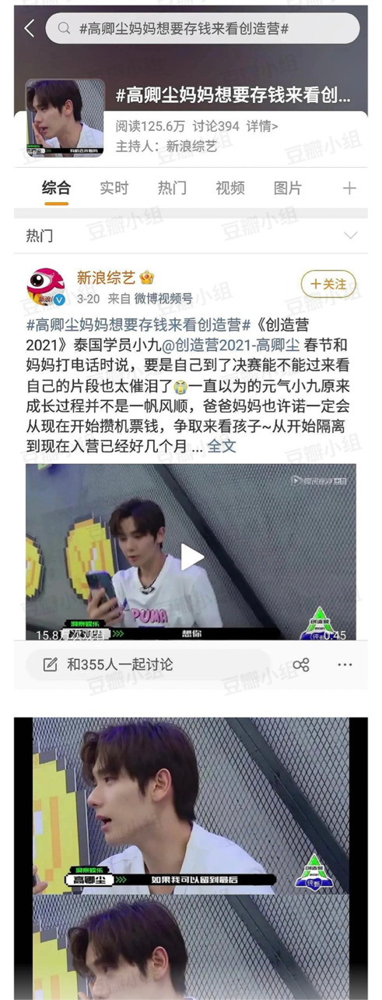
  

### 哔哩哔哩多视频安利

  

    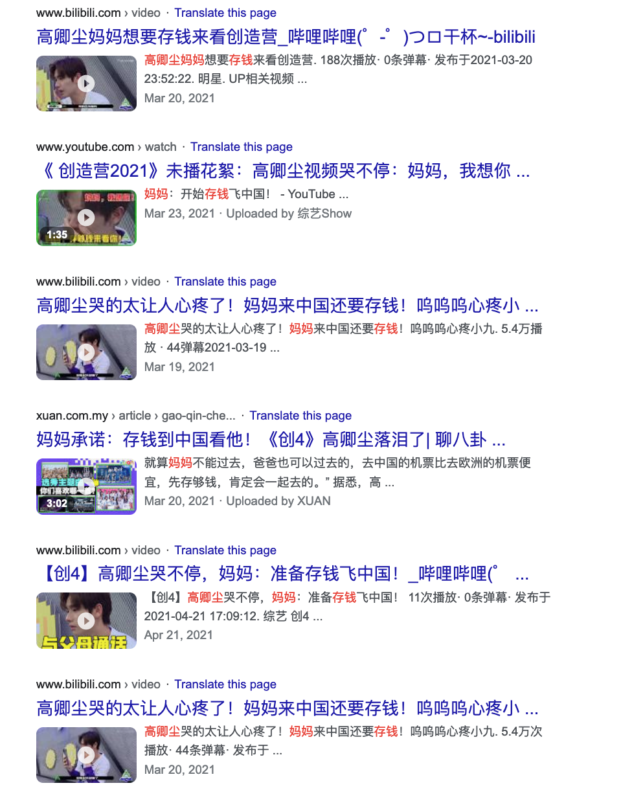
  

### 用户均买单人设

从微博，豆瓣，到视频网站哔哩哔哩，通过用户的评论可能看出，营销的人设十分的成功，均表示支持小九，博得了同情分并拉了一波好感。

  

    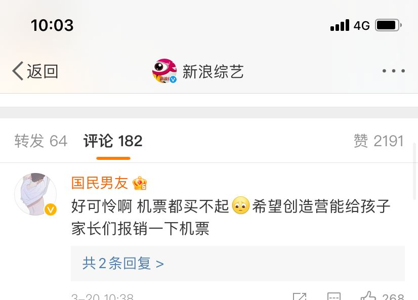
    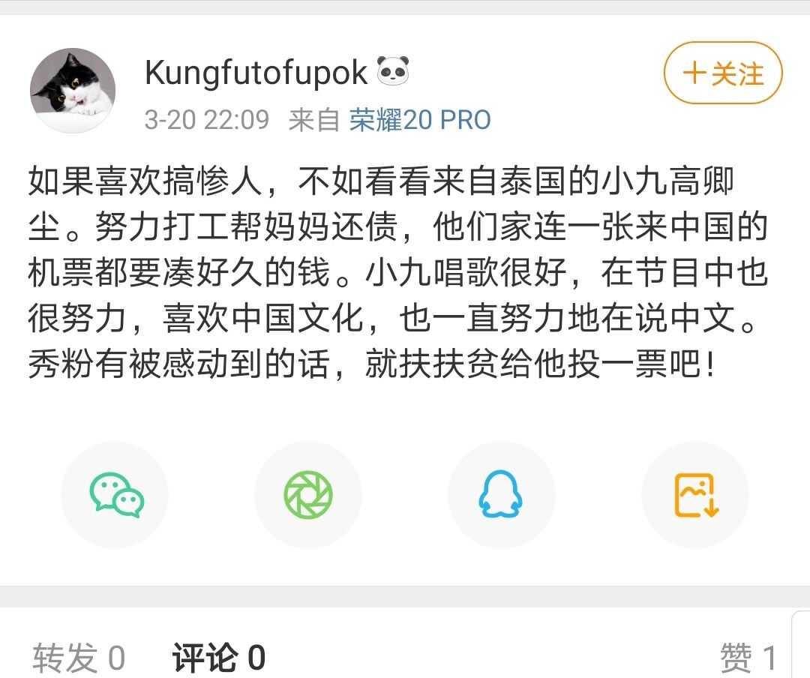
    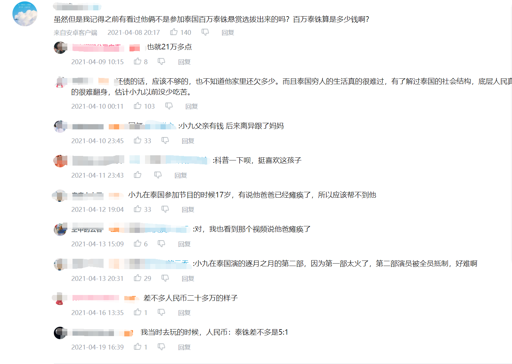
    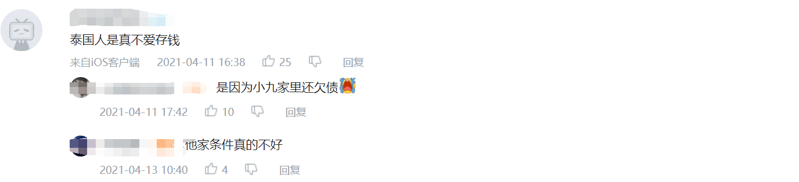
    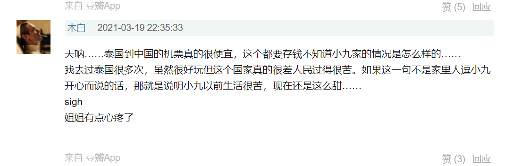
    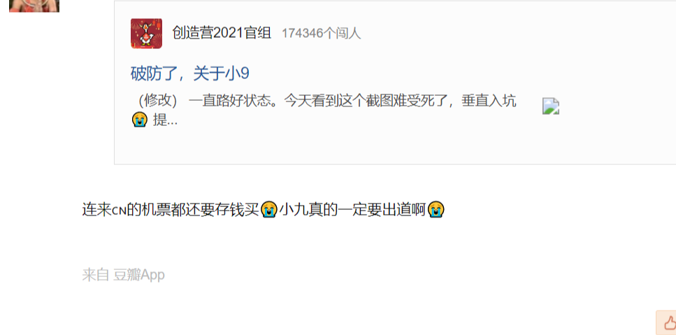
  

粉丝称其家境不好，极力卖惨，呼吁路好帮忙投票、做数据。爱豆不靠业务能力却靠编造穷苦的身世来获取同情和支持，这究竟传递了什么样的价值观？

  

    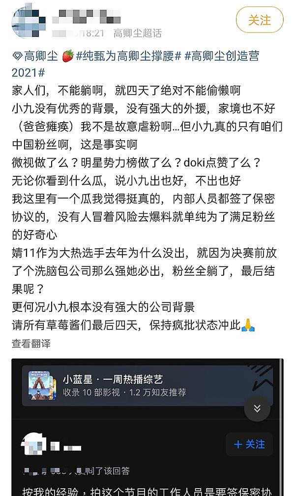
  

许多网友表示，因为高卿尘当时的贫苦家境卖惨人设感到同情并打钱。

  

    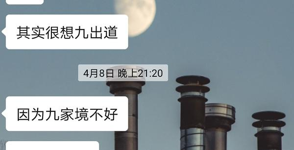
    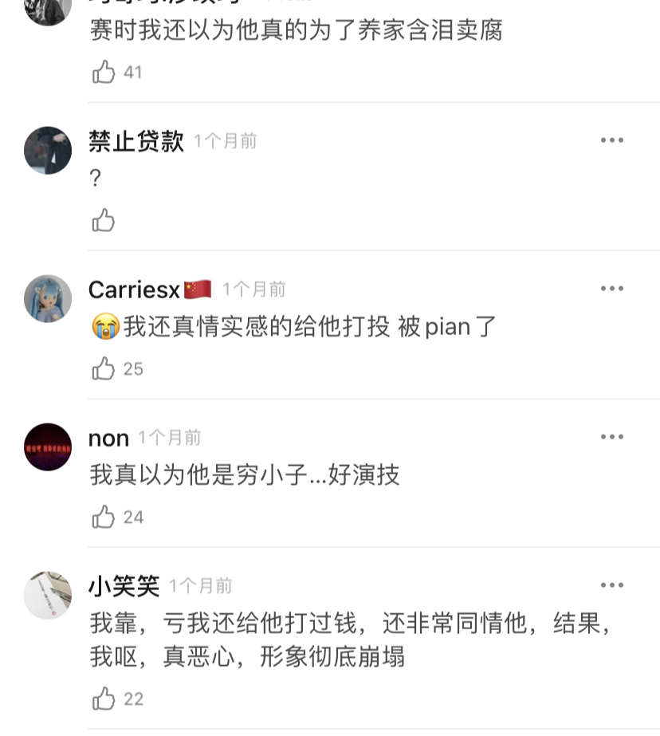
  

高卿尘家人一通电话给大家留下家境贫困的初印象；洞察娱乐嗅觉灵敏在社交平台大力营销“贫困”人设，获得了路人怜爱；高卿尘本人更是鸡贼的利用大众同情心，在创造营期间**多次强调**家人辛苦，**暗示**家境不好，卖弄贫苦人设，变成他的流量密码，吃尽人设福利。
{:.error}

# 真实家境

我们尊重他人隐私，不会以非法手段去获得他们的财务状态。俗话说，
`管中窥豹，可见一斑`{:.info}。我们可以从在公共平台获得的信息，以及他们自己主动在社交平台发布的动态去大致的推测他们的生活情况是怎样的。

我们本着求实的心态去搜集资料，结果是让我们大跌眼镜。高卿尘家境不仅和节目中塑造的人设毫无关系，甚至可以说背道而驰，冠以“富二代”名义都不为过。

高卿尘因为是公众人物，且双方父母均经商，很多资料都在网络上公开。以下我们会从他们家的家庭成员：父亲，母亲，姐姐以及高卿尘本人，分别探讨他们的生活情况如何。

⚠️本帖所用到的所有素材，均取自提及人物开放的社交网络 
⚠️以免被说8素人，对提及人物的公开图片均做打码处理 
⚠️以免被说8素人，对未出镜《创造营2021》的父亲做打码处理
⚠️本帖讨论的重点不是艺人家庭如何使用自己的💰，而是享受着相对富裕生活的同时，却在🇨🇳选秀节目中卖惨买不起机票，利用社会大众的同情心来为自己获得流量和财富。

🚧🚧🚧点击下方标题进入正文，此贴不定期更新中......🚧🚧🚧
{:.success}

  <section class="my-5">
    
    
  </section>

