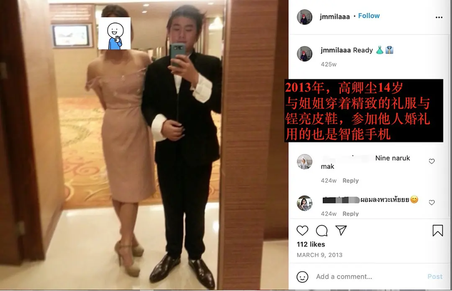
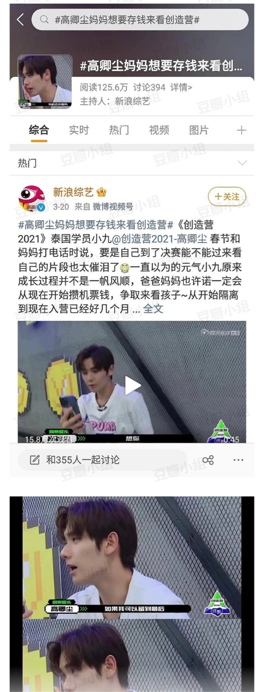
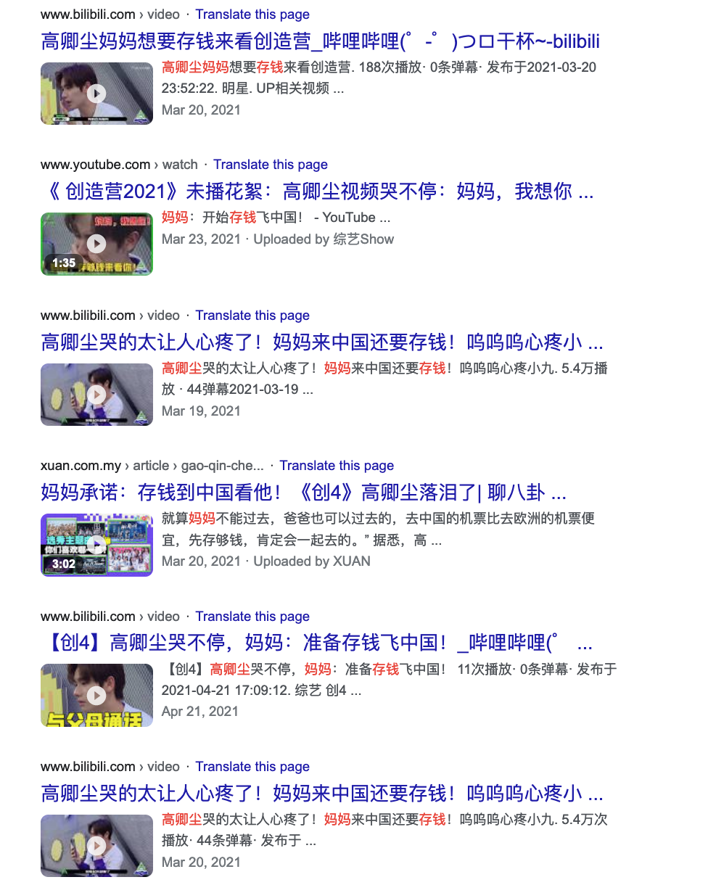
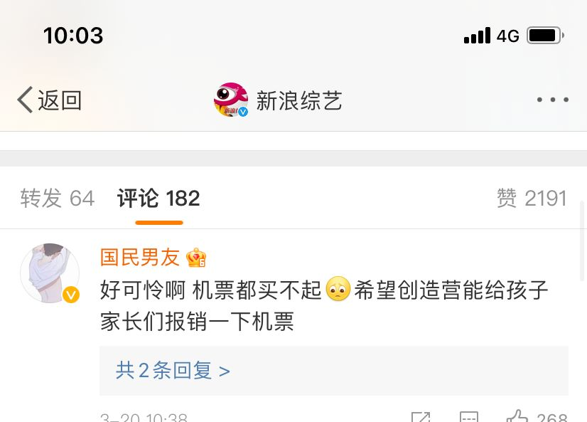

本站所有内容都会**不断更新和校正**，保证资料的真实和准确，所有内容都以发布在网站的内容为准，若读者看到关于本网站的截图与网站内容有出入的，视为截图无效。欢迎各位读者投稿和校正。
{:.warning}

**阅前必读**

⚠️ ⚠️ ⚠️家境并不贫困，却企图利用公众的同情心，刻意营销`贫困人设`{:.info}的标签🏷️获得流量和关注，这是什么行为？这是**欺诈**。

同期参加创造营的学员，不仅从小在农村长大，后靠自己努力成为抖音网红而过上不错生活的中国选手**张欣尧**；也有同样来自农村家庭的体育生**甘望星**[^1]； 更有追求自己艺人梦想的外卖小哥**门胁慎刚**[^2]。大家均不是来自于富裕的家庭，却无一人在节目中**靠渲染身世卖惨**来博关注，而是靠着节目中的努力和汗水希望获得观众的认可。

[^1]: [选秀，富二代的游戏？](https://www.ellemen.com/living/a36258717/chuang-210427/)
[^2]: [外卖小刚励志追梦引关注](https://www.163.com/dy/article/G3UCSGMA0514R9OJ.html)

高卿尘从3月开始，就在各平台铺营销塑造贫困人设，身为选秀节目参赛选手，不靠自身实力，却走旁门左道去博关注，实在可悲。

# 从小到大就读私校

这是高卿尘OG泰国粉丝做的关于高卿尘学历的宣传图，可见高卿尘从幼儿园到大学，仅读过两所学校:
1. [Roong Aroon School](#从幼儿园开始就读私立学校)
2. [Assumption University](#现就读私立大学)

  

      
  

# 从幼儿园开始就读私立学校

  

    
  

这是泰国粉丝给高卿尘做的宣传图里学历部分的泰语翻译：幼儿园至高中，就读于**Roong Aroon School**。根据学校[官方网站的英文版宣传册](http://img.roong-aroon.ac.th/2562-1/RA-HolisticEDU-ENG-resize.pdf),该学校成立于1996年的**私立学校**。

  

    
  

该校是泰国提供 `alternative education` 的**私立学校**比较有名的学校之一，在CNA的新加坡版本关于这所学校的报道[^3]中，特地提到了能够提供`alternative education`的学校在泰国不是一般家庭能负担的起的。而我们的主人公**Roong Aroon School**正是这类学校的代表

以下为原文节选：
> In Thailand, however, **tuition fees** for alternative schools are usually **comparatively high. Not every family can afford to pay for private educational establishments offering an alternative curriculum.** Most children attend public schools where traditional teaching and learning methods are the norm. 
> ...
> **Roong Aroon School** - School of Dawn - in the capital Bangkok is among Thailand’s most prominent pioneers in alternative education. 
> ...

**绝大部分**的泰国儿童都是去读公立学校的，而高卿尘却从4岁开始就进入了提供独特教育的**私立学校**。

[^3]: [Can ‘alternative schools’ revolutionise Thai education and improve children's capabilities?](https://www.channelnewsasia.com/news/asia/alternative-school-education-helps-students-in-thailand-11570494)

因为其提供独一无二的教学体验，学费也是非常的昂贵。我们从学校官方了解到从幼儿园到高中的最新收费情况如下：

  

    
  

我们知道高卿尘从小就英文教学，但是为了严谨，我们就按照最最最便宜的泰国项目(thai program)来算他从幼儿园到高中的的总花费（**尽计学费**）：

60000(entrance fee)+115200x3+135000x6+156000x6 = 5151600 (折合一百万人民币)

注意⚠️，这里还未包括生活费，学校活动费等其他费用。

有粉丝可能要狡辩了，“高卿尘就读时学费没有那么贵啊”，且不论不考虑通货膨胀的说法就是在耍流氓，已知在高卿尘出生以前，泰国政府就已给全体泰国公民的小孩提供提供12年的**免费义务教育**。有免费的政府公立学校不去上，却从幼儿园就开始读私立的高卿尘，在节目中屡次卖“贫困人设”获得流量，难道值得同情吗？

  

    
  

再来回顾一下高卿尘对小时候的回忆：

  

    
  

# 现就读私立大学

高卿尘本人大学就读于全英文授课的私立大学易三仓大学。

  

    
  

该私校相比于泰国其他公立大学收费不菲，我们可以从[官网得知](https://admissions.au.edu/?page_id=1375)泰国本地学生就读BA专业，四年**仅仅是学费** 就差不多50万泰铢，折合人名币十万左右。而在泰国排名第一的公立大学Chulalongkorn University学费(commerce,after year 2013)才 **17000x4=68000**泰铢，折合人名币差不多1万四千。

  

    
    
    
  

顺便附上在泰网友对易三仓大学的评论👇：

  

    
  

从幼儿园至大学本科，高卿尘都就读于收费不菲的**私立学校**，请问高卿尘本人对“小时候，我们的家庭情况还不太好”的“不太好”是否有什么误解？是否对标了泰国王子的生活才会觉得有钱去接受私立教育的生活**也“不太好”**？
高卿尘四年学费为491,800泰铢（每年都在涨价，此处为最新学费），换算成美元的四年学费为$15,793.19，每年为$3,947.30。一年学费总费用，已远超泰国人均收入。这样的家庭不说多么富裕，但是与困难也沾不了边吧。怎么会在节目中说，连一张来华的机票都要先存够钱才可以呢？
{:.error}

  

    
  

# 生活开销不菲

## 创造营期间出现的物品

高卿尘本人在给妈妈打电话时，拿的手机为最新发售的iPhone 12 pro。

  

    
  

在Apple泰国官方网站上看到的此型号的手机起价36900泰铢。

  

    
    
  

网友在4月份搜索泰国往返机票后留言如下；

  

    
  

高卿尘曾在大岛日记中佩戴价值**3w5人民币**的私人手表。

  

    
  

## 从小穿戴金贵

下图为**2006**年高卿尘与其父亲跑车的合影。

  

    
    
    
    
    
    
    
  

  

    
    
      
  

我们再来回顾一下，3月17日播放年夜饭特辑后，高卿尘营销的高位热搜以及观众的评论。

  

    
    
  
    
  

不得不说，高卿尘及其背后的洞察娱乐的确非常懂得在内娱的生存之道，利用中泰的信息差和公众对“正能量励志人物”的天然好感营造虚假人设、欺瞒观众，利用大众的同情心收割流量。诚然，任何使用这种卑劣手段的明星都应受到抵制，然而对于有国籍、语言差异的外国艺人，我们更是需要警惕，否则像高卿尘这样利用信息差为名利而不择手段的外籍艺人会层出不穷、照猫画虎，欺诈善良的中国民众。

# 粉圈常见逻辑谬误及辩驳(一)

首先，人类在接收到与自我认知有偏差的信息时，本能的反应是defense而非倾听和思考。
其次，选秀粉圈的平均年龄相对较小，很多粉丝缺乏独立思考的能力，也尚未形成完整的价值体系，所以更容易被所谓的“大粉”带偏、随大流。
下面列举一些高卿尘粉丝常见的逻辑谬误，并据此进行辩驳。希望能够帮助大家保持理智，打蛇七寸。

有理不在声高，也不再字大，更不在重复。
{:error}

  

    
  

  

    

      <h4>高卿尘口中“小时候家境不好”的逻辑错误</h4>
    

    

      
此"澄清帖"找不出节目中所说的“小时候家庭情况不好”具体是哪一年，却以此来反驳我们的证据是抹黑。这里犯的是诉诸无知的逻辑错误 
      <strong>诉诸无知(argument from ignorance)</strong>: 宣称由于某事未被证明为假，因此是真的；或由于某事未被证明为真，因此是假的。 
      辩驳参考：在缺乏实锤证据的时候用肯定的语气说出一个未被证实的事情，是在造谣，劝对方别造谣。 
      举个例子：帖中说"譬如2008年泰国紧急出现了最大幅度的衰退，他9岁，家庭情况未知"。 
      一句话两个逻辑漏洞，1. 因果谬误，2008年的经济衰退，和他的的家世请问有任何因果关系？虽然经济衰退大概率让企业效益减少，在衰退中获得机会而企业腾飞的也不少；2.既然"澄清帖"都承认家庭情况未知，而高卿尘从4岁开始<strong>无间断</strong>读私校，ins从7岁就有跑车合影，以及其姐姐与本人在社交网络上的照片是否正好展示了他家境不错的一面，而且从4岁开始就不错？所以这位作者的澄清是否更加做实了我们的证据？
      

    

  

  

    
  

  

    

      <h4>高卿尘学校澄清的逻辑错误</h4>
    

    

      

       
      所谓的“澄清帖”一共就写了两点，每一点都没有提出任何证据不说，更是漏洞百出。 
      
      我建议身为粉丝的这位作者去重温一下高卿尘的电话视频以避免尴尬😅。高卿尘的母亲不仅在电话里说“存钱买机票”，更说了“去中国的机票比去欧洲的便宜”以及接下来的“先存够钱先”。

      "澄清“的论证聚焦在妈妈说的是“存钱”不等于”买不起“，不仅打脸妈妈的原话"先存够钱先“,更犯了"quoting out of context"的非形式谬误。此谬误是攻击稻草人谬误的一种。
    
      攻击稻草人谬误：
      <em>攻击稻草人是曲解对方的论点，针对曲解后的论点（替身稻草人）攻击，再宣称已推翻对方论点的论证方式，是一种非形式谬误。</em> 我们的原文通过对他本人从小到大的生活方式的分析，阐述了高卿尘通过营销“贫困”人设来获得流量和关注，而实际生活并不贫困这一论点。粉丝所谓"澄清文"首先模糊原文论点，再给原文强加“买不起”和“存钱买”的认知谬误。  
      我说，这些说“黑子”们“曲解”高卿尘母亲所言的粉丝们，请问微博卖惨营销铺天盖地时，喜欢玩文字游戏的你们为何不去澄清一下呢？打配合的卖惨言论删干净了吗就来强行洗地？不尴尬吗？
        

      “不由妈妈支出的学费混淆成由家庭支出，引导看帖人认同其所偷换的概念” 👈  的逻辑错误： 
      转移举证责任（Burden of proof） 
      <em>知识论争议中一般共识：试图要他人接受一件事的人有义务为那件事提供适当理据。</em> 此澄清非常肯定的说学费不是由妈妈支出，请问是否由证据？<strong>辩驳：请出示学费不由妈妈支出的证据，否则你也无法证明学费的确由妈妈承担（或部分承担）</strong>
   

    

  

