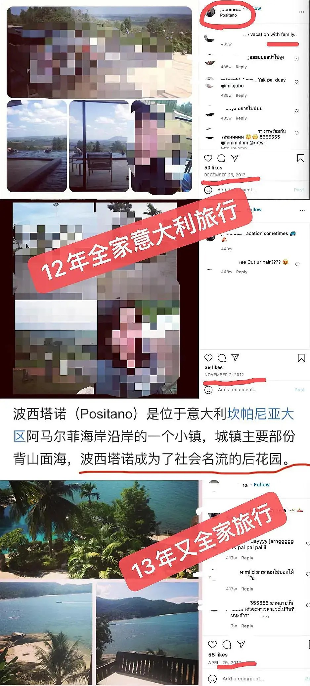

本站所有内容都会**不断更新和校正**，保证资料的真实和准确，所有内容都以发布在网站的内容为准，若读者看到关于本网站的截图与网站内容有出入的，视为截图无效。欢迎各位读者投稿和校正。
{:.warning}

高卿尘的姐姐在2014年的时候满20岁，即1994年出生，比1999年出生的高卿尘大了5岁。所以高卿尘在节目中说的小时候家境不好，高卿尘的姐姐必定都体验过。

  

    
  

然而与高卿尘一起生活的姐姐却一直名包傍身，吃喝玩乐样样不落，环游世界，星巴克常客，私家车出行......

# 从小到大的私立教育

高卿尘的教育经历可以说是他姐姐的复制版本。高卿尘姐姐也从小就读于Roong Aroon School的私立学校，大学去读了易三仓大学。幼儿园到高中毕业的花费，仅仅是学费就要上百万，更别提私立大学的花费。关于学校的收费情况，我已经在[高卿尘本人](https://into1-police.github.io/nine/nine-finance)的帖子里进行详细的介绍，本文不再赘述。

在节目中屡次强调自己"小时候"家境不好的高卿尘家里，却能从小就负担姐弟俩就读私校哦。

图来自高卿尘姐姐ins公开照片

  

    
  

高卿尘姐姐还曾去新西兰奥克兰留学一年，再来看看姐姐就读的位于新西兰的学校，一年学费20,926新西兰币（来源：2021年学校宣传手册），接近10万人民币。 

  

    
  

# 有钱各国旅游

首先，已知高卿尘与母亲和姐姐一直生活在一起，那么由姐姐的社交网络可推测出一家人的生活处境。从姐姐的公开INS可以看出，她是一个非常热爱生活的人，INS上都是吃喝玩乐，本人留学于新西兰奥克兰，几乎每年都会去韩国度假，也经常去新加坡、中国香港、中国广州、中国上海、马来西亚等地度假。

  

    
    
    
  

录制有度假vlog在自己的油管主页，写有旅行游记在自己的博客，同时也是一名美妆博主。

  

    
  

# 穿戴奢侈品

这里是在父亲的公司North Fitness与父亲（打码）弟弟的合照，注意姐姐背的包

  

    
    
    
    
    
  

所以小时候家庭条件不好，到底是那个小时候呢？高卿尘姐姐比他大5岁，能看出来高卿尘姐姐也是个乐观向上，面对挫折的孩子。所以即使家庭条件不好，即使每一笔钱都要精打细算，也要环游世界，名包傍身，做星巴克常用客户，开私家车出行，很早用上iPhone产品全线，连台式都是iMac......

  

    
  

  

    
iPhone, iPad, iMac齐活

  

高卿尘还有个弟弟, 也就读于泰国的双语私立学校。

  

    
  

  

    
弟弟就读的私立学校

  

所以能养活三个孩子的家庭，能支持三个孩子从幼儿园就开始就读私立学校的家庭，到底是为什么在高卿尘的眼里会条件不好呢？
{:.warning}
