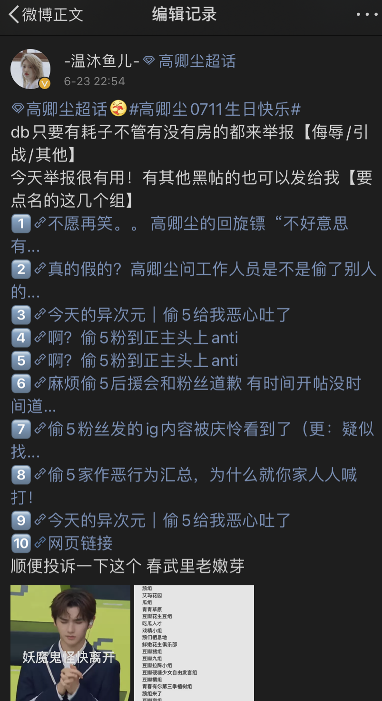
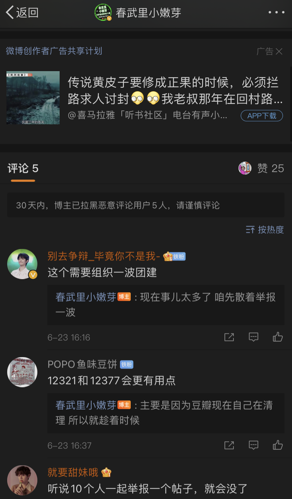
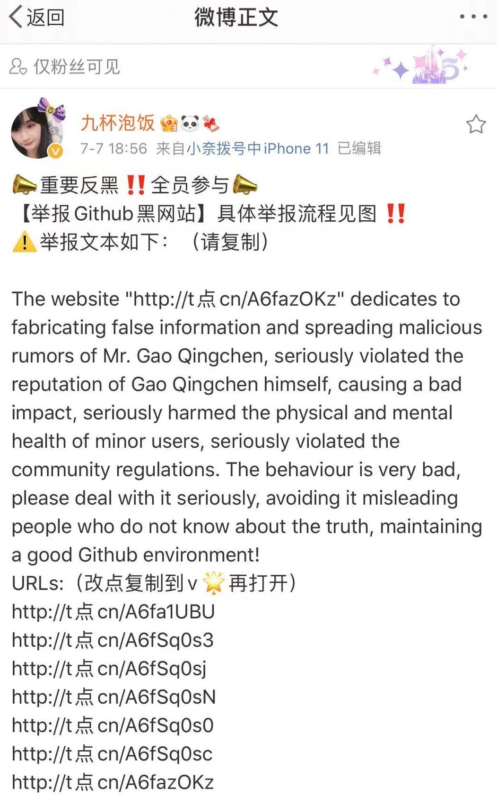
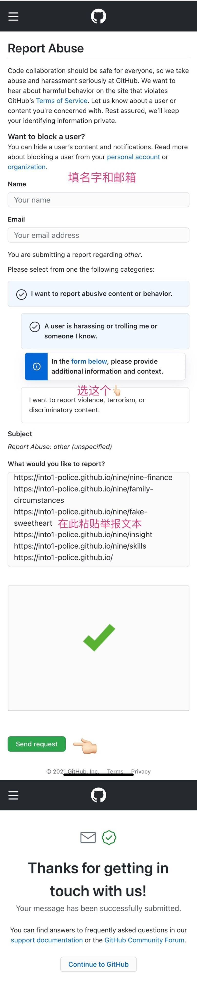

本站所有内容都会**不断更新和校正**，保证资料的真实和准确，所有内容都以发布在网站的内容为准，若读者看到关于本网站的截图与网站内容有出入的，视为截图无效。欢迎各位读者投稿和校正。
{:.warning}

举报投诉本来是网友通过举报形式参与社区管理的一种有效途径，但是却被高卿尘粉丝用来当成了打击报复其他粉丝的秘密手段。由于不少公正评判高卿尘和高卿尘粉丝的帖子被恶意举报删掉，浪费个平台监管的大量人力物力去核查子虚乌有的问题。滥用举报的实质是披着“清朗饭圈”的外衣，实则是为高卿尘粉丝左右舆论扫清障碍。

以下投稿为高卿尘粉丝**滥用举报**，借用举报打击说出真相，干扰建设良好社区氛围的行为。

# 6月，集中举报豆瓣小组

高卿尘粉丝利用自身影响力，在微博上号召其他粉丝恶意举报。

  

    
    
  

  

    
在高卿尘官方超话里，引导粉丝不管是不是小组用户，都去恶意举报豆瓣小组

  

# 7月，恶意举报本网站

本网站接到投稿，高卿尘粉丝于7月8号开始，在github上对本网站进行恶意投诉和举报，并写好举报范文。
本网站目前未收到任何高卿尘粉丝就本网站上公布的内容不实的纠正或者交涉。本网站以发布事实为目的，如若高卿尘粉丝发现不实内容，欢迎写信到**into1.police@gmail.com**. 

以下为高卿尘粉丝投诉本网站的原文：
> 重要反黑‼️全员参与📣
【举报Github黑网站】具体举报流程见图 ‼️
⚠️举报文本如下：（请复制）
> The website "http://t点cn/A6fazOKz" dedicates to fabricating false information and spreading malicious rumors of Mr. Gao Qingchen, seriously violated the reputation of Gao Qingchen himself, causing a bad impact, seriously harmed the physical and mental health of minor users, seriously violated the community regulations. The behaviour is very bad, please deal with it seriously, avoiding it misleading people who do not know about the truth, maintaining a good Github environment!

  

    
    
  

  

    
在并未交涉的前提下，在Github官方恶意举报

  

